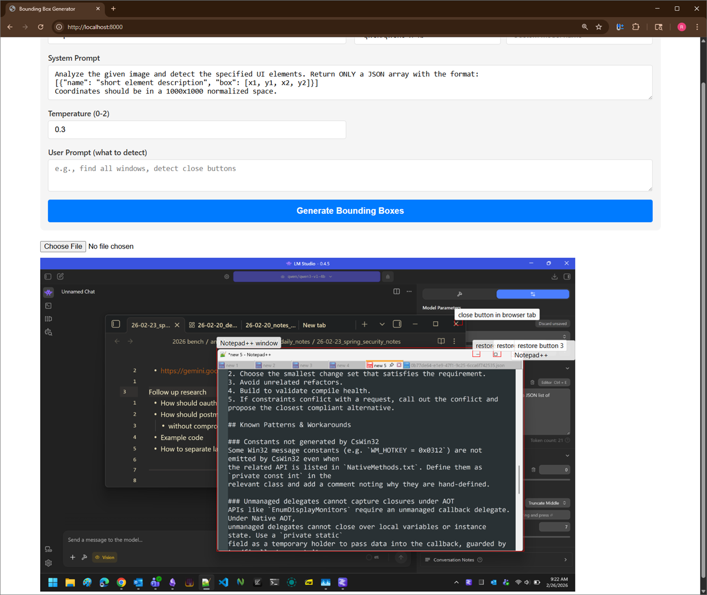

## About

Experimenting with usage of a vision model for generating bounding boxes from images based on description.

Screenshot:


## How to run

Have local LLM server (e.g. LM Studio) with a vision model up and running.

By default this assumes the base URL `http://localhost:1234/v1/` to be the llm server base URL

Serve the HTML and scripts:

```bash
# default: serves at localhost:8000
python -m http.server
```

